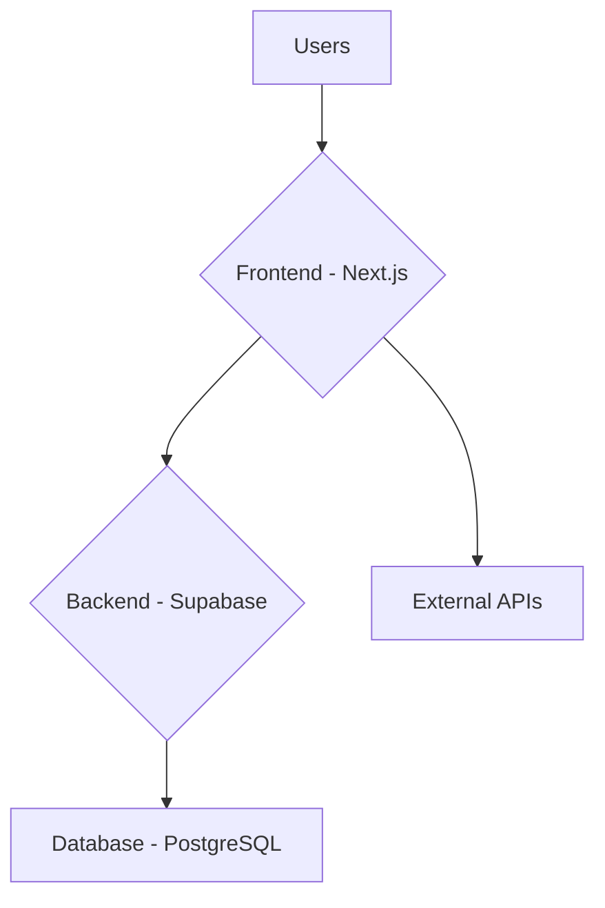

# Technical Plan: Rooquesty Hackathon Warm-up App

This document outlines the technical plan for building the "rooquesty hackathon warm-up app".

## 1. Application Architecture

The application will be composed of three main parts: a Next.js frontend, a Supabase backend, and a PostgreSQL database.

*   **Frontend:** A Next.js application responsible for rendering the user interface. It will use Tailwind CSS for styling and shadcn for UI components. The frontend will fetch content from external APIs and interact with the Supabase backend for user-generated data.
*   **Backend:** Supabase, hosted locally with Docker, will provide the backend services, including a PostgreSQL database, authentication (if added later), and APIs for interacting with the database.
*   **Database:** A PostgreSQL database managed by Supabase will store application data, such as user reactions and comments.

## 2. Data Models

The following Supabase table schemas are proposed:

### `items` Table
This table will store the content displayed in the grid (memes and jokes).

| Column        | Type                      | Description                               |
|---------------|---------------------------|-------------------------------------------|
| `id`          | `uuid` (Primary Key)      | Unique identifier for the item.           |
| `type`        | `text`                    | Type of content (e.g., 'cat_meme', 'yoda_meme', 'dad_joke'). |
| `content_url` | `text`                    | URL to the meme image/GIF. Null for jokes. |
| `text_content`| `text`                    | The text of the dad joke. Null for memes. |
| `external_id` | `text`                    | ID from the source API to avoid duplicates. |
| `created_at`  | `timestamp with time zone`| Timestamp of when the item was created.   |

### `reactions` Table
This table will store user reactions and comments for each item.

| Column     | Type                      | Description                               |
|------------|---------------------------|-------------------------------------------|
| `id`       | `uuid` (Primary Key)      | Unique identifier for the reaction.       |
| `item_id`  | `uuid` (Foreign Key)      | References the `id` in the `items` table. |
| `user_id`  | `uuid`                    | References a user if auth is implemented. |
| `type`     | `text`                    | Type of reaction (e.g., 'emoji', 'gif', 'text'). |
| `content`  | `text`                    | The reaction content (emoji, URL, or text). |
| `created_at`| `timestamp with time zone`| Timestamp of when the reaction was posted. |

## 3. API Integration

The following free APIs will be used to source content:

*   **Cat Memes:** `https://cataas.com/cat/says/:text` - Generates a cat image with custom text.
*   **Baby Yoda Memes:** `https://g.tenor.com/v1/search?q=baby-yoda&key=LIVDSRZULELA` - Tenor API for Baby Yoda GIFs.
*   **Dad Jokes:** `https://icanhazdadjoke.com/` (Accepts `application/json` header) - Provides random dad jokes.

## 4. Component Breakdown

The frontend will be built using the following React components:

*   **`ShowcaseGrid`**: The main container for the animated grid. Manages the overall layout and panning animation.
*   **`GridColumn`**: Represents a single vertical column in the grid, containing multiple cards.
*   **`MemeCard`**: A card component to display an image-based meme (Cat or Baby Yoda).
*   **`JokeCard`**: A card component to display a text-based dad joke.
*   **`FullscreenModal`**: A modal that appears when a card is clicked, displaying the content in a larger view and including the reaction stream.
*   **`ReactionStream`**: A component within the modal to display a live-updating list of reactions for the selected item.
*   **`ReactionInput`**: A form within the modal for users to submit their own reactions (emojis, text, etc.).

## 5. Implementation Steps

1.  **Project Setup:**
    *   Initialize a new Next.js project: `npx create-next-app@latest`.
    *   Integrate Tailwind CSS and shadcn for styling and UI components.
    *   Set up a local Supabase instance using Docker.

2.  **Backend Configuration:**
    *   Using the Supabase UI or a SQL script, create the `items` and `reactions` tables as defined in the Data Models section.

3.  **API Integration:**
    *   Develop utility functions or services in the Next.js app to fetch data from the three external APIs.
    *   Implement logic to normalize the data from these different sources before displaying it.

4.  **Frontend Development:**
    *   Build the `ShowcaseGrid` component, implementing the vertical panning animation using CSS or a library like `framer-motion`.
    *   Create the `MemeCard` and `JokeCard` components to render the different content types.
    *   Implement the `FullscreenModal` component.
    *   Develop the `ReactionStream` to fetch and display reactions from Supabase.
    *   Create the `ReactionInput` form to allow users to post new reactions to Supabase.

5.  **Connecting Frontend and Backend:**
    *   Implement the logic to populate the `ShowcaseGrid` with data fetched from the external APIs.
    *   When a card is clicked, pass the item's data to the `FullscreenModal`.
    *   The `ReactionStream` will fetch reactions for the current item from the `reactions` table in Supabase.
    *   The `ReactionInput` will insert new entries into the `reactions` table.

6.  **Styling and Final Touches:**
    *   Apply a consistent and visually appealing design using Tailwind CSS.
    *   Ensure the application is responsive and works well on different screen sizes.
    *   Add the hover-to-pause functionality on the `GridColumn` components.

## 6. Tooling

*   **Frontend:** Next.js, React, Tailwind CSS, shadcn
*   **Backend:** Supabase
*   **Database:** PostgreSQL
*   **Containerization:** Docker (for local Supabase)
*   **Package Manager:** npm or yarn